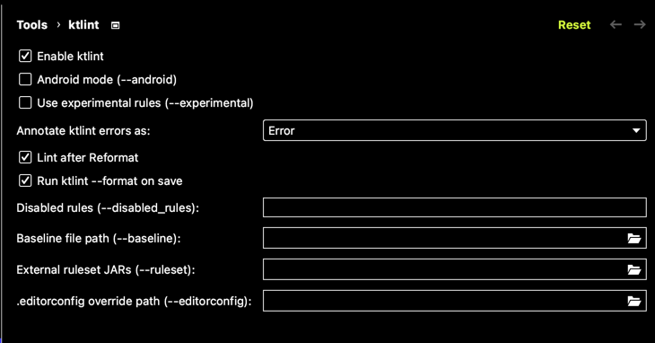

# Backend

### Docker 컨테이너 띄우는 방법

1. 프로젝트 최상단 경로로 이동
2. 터미널에서 아래 명령어 작성\

```
docker-compose up
        또는
docker-compose start # 백그라운드에서 실행
```

3. ```docker ps``` 명령어 입력 후 mysql 컨테이너 띄워졌는지 확인

### ktlint 적용 방법

1. Settings -> Tools -> ktlint 클릭후 아래 사진과 같이 설정
   

Tip!\
Mac - Settings 단축키\
```command + ,```
